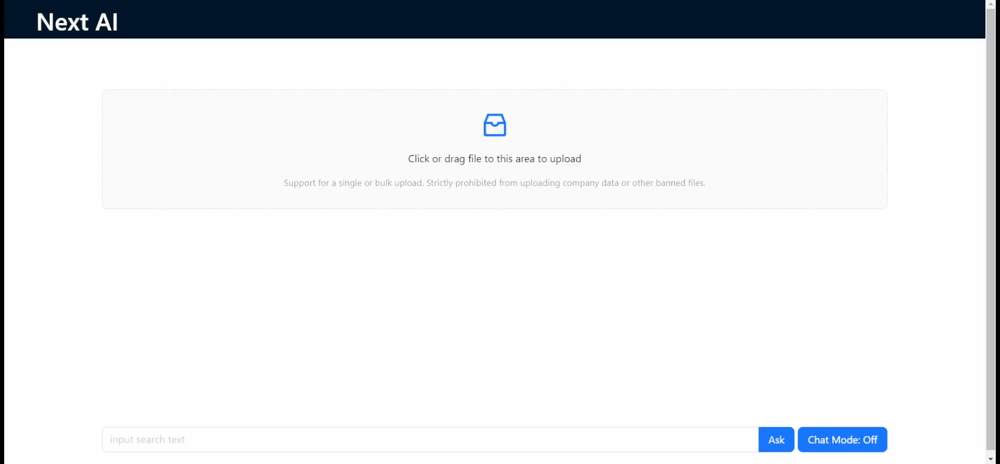

# NextAI Express + React 

本项目整合了 Express 服务端与 React 前端，通过 Express 代理实现安全的 LLM API 调用，可以实现快速构建具备 AI 能力的现代化 Web 应用。

前端处理界面交互，Express 中转并保护 API 密钥，同时支持流式响应*、文件处理和会话管理。

---

## 功能特性

- **React 前端**：使用 React 18+ 和 TypeScript 构建响应式 UI
- **Express 后端**：安全代理 NextAI API 调用，保护 API 密钥
- **流式响应'**：支持流式文本生成（打字机效果）
- **会话管理**：保存和恢复对话历史
- **文件处理'**：支持图片上传和处理（多模态）
- **全栈开发**：一套代码库同时管理前后端
- **开发体验**：热重载、ESLint、Prettier 集成
- **部署就绪**：支持 Docker、PM2、云平台部署

---

## 技术栈

### 后端
- Node.js 18+
- Express 4.x
- axios/node-fetch（API 调用）
- cors、helmet（安全中间件）
- multer（文件上传，可选）

### 前端
- React 18+
- TypeScript 5+
- Vite/Webpack/Create React App（构建工具）
- TailwindCSS/MUI/Ant Design（UI 库）
- Redux（状态管理，任选）

---

## 项目结构(参考)

```
nextai-express-react/
├── client/                    # React 前端
│   ├── public/
│   ├── src/
│   │   ├── api/               # API 调用
│   │   │   └── nextai.js      # NextAI 客户端
│   │   ├── components/        # React 组件
│   │   │   └── Chat/
│   │   ├── hooks/             # 自定义 Hooks
│   │   │   └── useStream.js   # 流处理 Hook
│   │   ├── store/             # 状态管理
│   │   │   └── chatStore.js   # 聊天状态
│   │   ├── App.js
│   │   └── main.js
│   └── package.json
│   
│   
│
├── server/                    # Express 服务器
│   ├── src/
│   │   ├── controllers/       # 控制器
│   │   │   └── nextai.js      # NextAI 代理控制器
│   │   ├── routes/            # 路由
│   │   │   └── api.js         # API 路由
│   │   ├── utils/             # 工具函数
│   │   │   └── stream.js      # 流处理工具
│   │   └── index.js           # 入口文件
│   ├── package.json
│   └── .env                   # 环境变量（包含 API 密钥）
│
├── package.json               # 根项目配置
├── .gitignore
├── README.md
└── docker-compose.yml         # 可选：Docker 配置
```

---

## 快速开始

### 环境要求
- Node.js 18+
- npm/yarn/pnpm

### 安装

```bash
# 克隆仓库
git clone https://github.com/QuantumBitstream/nextai.git
cd nextai-express-react

# 安装依赖
npm install        # 或 yarn / pnpm install

# 安装前后端依赖
npm run setup      # 运行自定义脚本安装子目录依赖
```

### 环境配置

1. 在 `server` 目录创建 `.env` 文件：

```
# NextAI API 配置
NEXTAI_API_KEY=your_api_key_here
NEXTAI_API_BASE_URL=https://api.nextai.com
NEXTAI_DEFAULT_MODEL=gpt-4o-mini

# 服务器配置
PORT=5001
NODE_ENV=development

```

### 开发模式

```bash
# 启动前后端（并行）
npm run dev

# 或分别启动
npm run server:dev
npm run client:dev
```

- 前端默认运行在：http://localhost:3000
- 后端默认运行在：http://localhost:5001

---

## 多模态支持（图片处理）

要添加图片上传和处理功能，可以扩展项目：

---

## 脚本配置

在根目录 `package.json` 中配置脚本：

```json
{
  "name": "nextai-express-react",
  "version": "1.0.0",
  "scripts": {
    "setup": "npm install && npm run setup:server && npm run setup:client",
    "setup:server": "cd server && npm install",
    "setup:client": "cd client && npm install",
    
    "dev": "concurrently \"npm run server:dev\" \"npm run client:dev\"",
    "server:dev": "cd server && npm run dev",
    "client:dev": "cd client && npm run dev",
    
    "build": "npm run build:client && npm run build:server",
    "build:server": "cd server && npm run build",
    "build:client": "cd client && npm run build",
    
    "start": "cd server && npm run start",
    
    "lint": "npm run lint:server && npm run lint:client",
    "lint:server": "cd server && npm run lint",
    "lint:client": "cd client && npm run lint"
  },
  "devDependencies": {
    "concurrently": "^8.0.1"
  }
}
```

---

## 部署

 - 构建前后端：
```bash
npm run build
```

 - Getting Started with Create React App

```javascript
// concurrently "npm start" "npm run server" 启动前端 启动后端
npm run dev

ctrl + c

npm i react-speech-recognition@3.10.0

npm i speak-tts@2.0.8

```


This project was bootstrapped with [Create React App](https://github.com/facebook/create-react-app).

---

## 📸 项目截图


[//]: # (![首页截图]&#40;server/assets/动画.gif&#41;)

<p align="center">
  
</p>

---

## 安全最佳实践

1. **永远不要在前端存储 API 密钥**
    - 只在后端环境变量中保存 NextAI API 密钥

2. **实现用户认证**
    - 添加用户登录系统，如 JWT、OAuth
    - 限制 API 调用频率和范围

3. **输入验证**
    - 验证和净化用户输入
    - 限制上传文件大小和类型

4. **CORS 配置**
    - 在生产环境中限制允许的来源

5. **安全标头**
    - 使用 Helmet 添加安全 HTTP 头

6. **监控与日志**
    - 记录 API 调用和错误
    - 设置监控和警报

---

## 扩展功能

1. **会话持久化**
    - 集成数据库（MongoDB/PostgreSQL）保存对话
    - 添加用户会话管理

2. **模型切换**
    - 在 UI 中添加模型选择器
    - 支持多种 NextAI 模型

3. **语音输入输出**
    - 集成 Web Speech API 或语音模型
    - 添加文本转语音功能

4. **主题和外观定制**
    - 添加暗色/亮色模式
    - 支持自定义主题

5. **插件系统**
    - 创建可扩展的插件架构
    - 支持第三方工具集成

---

## 常见问题解答

**Q: 如何处理 API 速率限制？**
A: 在服务器端实现请求队列和节流，使用 Redis 或内存缓存跟踪请求速率。

**Q: 如何处理长对话历史记录？**
A: 实现对话历史修剪或摘要，仅保留相关上下文。

**Q: 如何改善流式响应的性能？**
A: 使用 WebSockets 而不是 SSE 来实现双向通信，可能提供更好的性能。

**Q: 生产环境中如何保护环境变量？**
A: 使用环境变量管理服务（如 Doppler 或 Vault），避免直接在部署配置中存储敏感信息。

---

## 贡献

欢迎提交 Pull Requests 和 Issues。请确保：

1. 代码遵循项目编码规范
2. 添加合适的测试
3. 更新相关文档

---

## 许可证

[Apache 2.0](https://opensource.org/licenses/apache-2-0)

---

